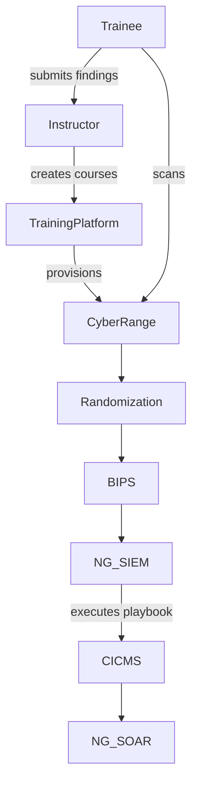

# Subcase 1b Guide: Penetration Testing and Vulnerability Assessment

See [deployment manual](deployment_manual.md) for baseline environment setup and teardown steps before running this scenario. Ensure required environment variables are configured as outlined in [env_variables.md](env_variables.md) before executing scripts.

## Objective
Provide self-paced training on penetration testing and vulnerability assessments. The Training Instructor creates courses and configures Cyber Range scenarios simulating CYNET's network infrastructure. Trainees run semi-automated penetration tests to locate potential vulnerabilities and attack entry points.

## Workflow Diagram



## Instructor Setup

1. **Install dependencies**
   ```bash
   pip install -r subcase_1b/training_platform/requirements.txt
   ```
2. **Create the Course**
   ```bash
   export INSTRUCTOR_PASSWORD='S3cureP@ss'
   sudo PASSWORD="$INSTRUCTOR_PASSWORD" COURSE_NAME=pentest-101 subcase_1b/scripts/training_platform_start.sh
   ```
   Starts the Flask service, registers the instructor, and creates the course via the REST API. The script
   refuses to run if `PASSWORD` remains at the insecure default value.

   To invite a learner:
   ```bash
   TOKEN=$(python subcase_1b/training_platform/cli.py login --username instructor --password "$INSTRUCTOR_PASSWORD")
   COURSE_ID=$(python subcase_1b/training_platform/cli.py list-courses --token "$TOKEN" | python -c 'import sys,json; d=json.load(sys.stdin); print(next(iter(d.keys())))')
   python subcase_1b/training_platform/cli.py invite --token "$TOKEN" --course-id "$COURSE_ID" --email learner@example.com
   ```
   Set `TRAINING_PLATFORM_URL` if the service runs on a host other than `localhost`.
3. **Enroll instructors and manage invitations**
   ```bash
   OPENEDX_TOKEN=<api-token> \
   subcase_1b/scripts/enrol_instructor.sh course-v1:Org+Code+Run instructor@example.com
   ```
   Creates an "instructors" cohort in Open edX, generates invitation codes via
   the `/invites` endpoint, prints the codes to stdout, and registers the
   addresses in KYPO through its API or the `kypo_participants.txt` file.
4. **Prepare Caldera**
   - Ensure the Caldera server is running and accessible to trainees.
   - Load a demo operation that the `sandcat` agent can execute.
5. **Start the Cyber Range and Security Pipeline**
   - Cyber Range
     ```bash
     sudo subcase_1b/scripts/cyber_range_start.sh
     ```
     Initializes the simulated CYNET network environment.
   - Randomization Evaluation Platform
     ```bash
     sudo subcase_1b/scripts/randomization_platform_start.sh
     ```
   - BIPS
     ```bash
     sudo subcase_1b/scripts/bips_start.sh
     ```
   - NG-SIEM and attachment processing
     ```bash
     sudo subcase_1b/scripts/ng_siem_start.sh
     ```
     Starts an ingestion service for trainee scan results, registers any attachments,
     executes the CA/CND Playbook through the CA Module for Integration, and stores results in MongoDB.
   - CICMS
     ```bash
     sudo subcase_1b/scripts/cicms_start.sh
     ```
   - NG-SOAR
     ```bash
     sudo subcase_1b/scripts/ng_soar_start.sh
     ```
   - Analysts monitoring these services can follow the [SOC Analyst Playbook](soc_analyst_playbook.md) for dashboard navigation, search queries, and alert confirmation criteria.
6. **Evaluation**
   - Review trainee scan logs and submitted vulnerability reports.
   - Confirm Caldera operations completed successfully.
   - Provide feedback through the training platform.

## Trainee Workflow

1. Log in to the trainee workstation and retrieve course material from the training platform.
2. Run the lab runner script.
   ```bash
   sudo subcase_1b/scripts/lab_runner.sh --target 10.10.0.4
   ```
   The script sequentially executes the approved tool profiles and produces expected deliverables:
   - `nmap` reconnaissance sweep – provides a list of reachable hosts and detected services.
   - Full TCP port scan using `nmap` – enumerates open ports and versions for the target.
   - OpenVAS scan driven by `openvas_task_template.xml` – generates a vulnerability report saved to `/var/log/trainee/openvas.json`.
   - OWASP ZAP baseline scan using `zap_baseline.conf` – saves an HTML report to `/var/log/trainee/zap.html`.
   - Caldera discovery profile (`caldera_profiles/discovery.json`) – runs the demo operation against the KYPO subnet.

    Output from each tool is appended to `/var/log/trainee/lab_runner.log`. Successful runs record messages such as:
    - `Reconnaissance sweep completed`
    - `Full TCP scan completed`
    - `Caldera discovery completed`
    - `OpenVAS scan completed`
    - `OWASP ZAP baseline scan completed`

The log file consolidates results for instructor review.
3. Compile the scan outputs into a findings report and submit it to the instructor.

### Customizing scan artifacts

The lab runner and training platform reference configurable templates located in `subcase_1b/`:

- `caldera_profiles/discovery.json`
- `zap_baseline.conf`
- `openvas_task_template.xml`

Each file contains the placeholder `KYPO_SUBNET` (default `10.10.0.0/24`).
Modify these files or export `KYPO_SUBNET` to adapt the exercises to a different
network.  Adjusting the contents allows instructors to tweak Caldera facts,
ZAP rules, or OpenVAS scan parameters to match their environment.

### Launching tools via API

Instead of using the helper script, trainees may trigger individual scans
through the training platform. First obtain an authentication token and then
launch a tool via the REST interface:

```bash
# start an OpenVAS scan
JOB_ID=$(curl -s -X POST http://localhost:5000/launch_tool \
    -H 'Content-Type: application/json' \
    -d '{"token":"'$TOKEN'","tool":"openvas"}' | jq -r '.job_id')

# check on the job
curl "http://localhost:5000/launch_tool/$JOB_ID?token=$TOKEN"
```

The status endpoint returns the current state (``pending``, ``running`` or
``completed``) and the path to any generated report under
``/var/log/trainee``.

## Phishing Awareness Quiz

The training platform includes a short phishing quiz to reinforce social engineering concepts. Trainees can use the following REST endpoints once authenticated:

- **Start quiz**
  ```bash
  curl "http://localhost:5000/quiz/start?token=$TOKEN&course_id=$COURSE_ID"
  ```
- **Submit answers**
  ```bash
  curl -X POST http://localhost:5000/quiz/submit -H 'Content-Type: application/json' \
       -d '{"token":"'$TOKEN'","course_id":"'$COURSE_ID'","answers":{"q1":0,"q2":1}}'
  ```
- **Retrieve score**
  ```bash
  curl "http://localhost:5000/quiz/score?token=$TOKEN&course_id=$COURSE_ID"
  ```

Scores are stored per user and course so progress can be tracked over time.

## Evaluation Flow

Trainee actions within the Cyber Range can be submitted back to the
training platform using the `POST /results` endpoint. The endpoint
calculates basic metrics such as quiz score and time spent on an
exercise and writes them to `results.json`. An internal progress value
is updated and forwarded to the Open edX `/courseware/` API so that the
learner's status is reflected in the LMS.

```bash
curl -X POST http://localhost:5000/results \
     -H 'Content-Type: application/json' \
     -d '{"token":"'$TOKEN'","course_id":"'$COURSE_ID'","score":2,"start_time":0,"end_time":42}'
```

The recorded metrics allow instructors to review completion times and
quiz performance when assessing learner progress.

To also record grades in the Open edX gradebook, export the following
environment variables so the training platform can reach the REST API:

```bash
export OPENEDX_GRADEBOOK_ENDPOINT='https://openedx.example/api/grades/v1/course_grade/{course_id}/{username}'
export OPENEDX_GRADEBOOK_TOKEN='your-gradebook-token'
```

The endpoint can include the placeholders ``{course_id}`` and
``{username}`` which are replaced at runtime.

## KYPO Lab Integration

The training platform can launch [KYPO](https://www.kypo.muni.cz/) labs
using the LTI 1.3 protocol. Configure the following environment
variables before starting the platform so that launch URLs can be
generated:

| Variable | Description |
| -------- | ----------- |
| `KYPO_URL` | Base URL of the KYPO LTI provider (default `http://localhost:5000`). |
| `LTI_CLIENT_ID` | Client identifier issued by KYPO. |
| `LTI_DEPLOYMENT_ID` | Deployment identifier for the integration. |
| `LTI_TOOL_PRIVATE_KEY` | RSA private key used to sign LTI launch tokens. It may contain the key itself or a path to a key file. |

### Generating and storing the LTI private key

Create a dedicated RSA key for the KYPO LTI consumer and store it in a
location only readable by the service account. A simple approach uses a
Docker/Podman secret mounted at `/run/secrets/lti_tool_private_key`:

```bash
openssl genpkey -algorithm RSA -out lti_tool_private_key.pem -pkeyopt rsa_keygen_bits:2048
chmod 600 lti_tool_private_key.pem
sudo mv lti_tool_private_key.pem /run/secrets/lti_tool_private_key
```

The `training_platform_start.sh` script automatically checks for the
`LTI_TOOL_PRIVATE_KEY` environment variable or, if unset, the secret file
above. For deployments using a secret manager such as HashiCorp Vault,
retrieve the key at runtime and export `LTI_TOOL_PRIVATE_KEY` before
starting the service:

```bash
export LTI_TOOL_PRIVATE_KEY=$(vault kv get -field=key secret/kypo/lti)
```

Ensure that the key is never committed to version control and that file
permissions restrict access to authorized users only.

When Open edX needs to start a KYPO session it should call the new
endpoint on the training platform:

```bash
curl -X POST http://localhost:5000/kypo/launch \
     -H 'Content-Type: application/json' \
     -d '{"token":"'$TOKEN'","lab_id":"intro-lab"}'
```

The response contains a pre-signed URL in the `launch_url` field. The
LMS should redirect the learner’s browser to that URL to open the lab.

### Creating an LTI component in Open edX

1. In *Studio*, open the course and navigate to **Settings → Advanced
   Settings**. Add `"lti_consumer"` to the *Advanced Module List* and
   save.
2. In the unit where the lab should appear, add a new **LTI
   consumer** component.
3. Set **LTI URL** to the training platform endpoint
   `http://localhost:5000/kypo/launch` (replace host if the platform
   runs elsewhere).
4. In **Custom Parameters** specify the target lab, e.g.
   `lab_id=intro-lab`. The component will POST this value together with
   the learner’s authentication token when rendering the unit.
5. Mark the component as **graded** if the KYPO exercise should
   contribute to the course score and assign an appropriate weight.

> **Deployment note:** After enabling `lti_consumer`, instructors should
> preview the unit in Studio to confirm the integration. Clicking the
> **Launch KYPO Lab** button should call the training platform’s
> `/kypo/launch` endpoint and redirect the browser to the KYPO lab. If
> no redirect occurs, verify that the training platform is running and
> that the lab identifier matches an available exercise.

When a learner accesses the unit, Open edX posts the parameters to the
training platform. The platform validates the token, generates a signed
LTI launch URL, and returns it to the LMS which then redirects the
learner into the KYPO lab.

### Mapping KYPO results to Open edX grading

KYPO activities report completion data back to the training platform via
the `/listener` endpoint. The platform aggregates submitted `score` and
`flag` values and forwards the metrics to Open edX using the
`/courseware/progress` API. The LTI component’s weight determines how
these metrics influence the final grade. Instructors can review the raw
aggregated data with the `/results` endpoint to understand the learner’s
performance and adjust grading policies as needed.

## Expected Outcomes

- Course creation logs at `/var/log/training_platform/courses.log`.
- Cyber Range initialization logs at `/var/log/cyber_range/launch.log`.
- Trainee scan results at `/var/log/trainee/scans.log` and progress stored in the training platform.
- Scan documents stored in MongoDB collection `scans` for later analysis.

## References

- [`training_platform_start.sh`](../subcase_1b/scripts/training_platform_start.sh)
- [`trainee_start.sh`](../subcase_1b/scripts/trainee_start.sh)
- [`cyber_range_start.sh`](../subcase_1b/scripts/cyber_range_start.sh)
- [`randomization_platform_start.sh`](../subcase_1b/scripts/randomization_platform_start.sh)
- [`bips_start.sh`](../subcase_1b/scripts/bips_start.sh)
- [`ng_siem_start.sh`](../subcase_1b/scripts/ng_siem_start.sh)
- [`ng_siem/app.py`](../subcase_1b/ng_siem/app.py)
- [`cicms_start.sh`](../subcase_1b/scripts/cicms_start.sh)
- [`ng_soar_start.sh`](../subcase_1b/scripts/ng_soar_start.sh)
