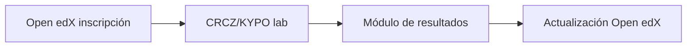

# Subcase 1b Penetration Testing Training

This scenario provides self-paced courses for penetration testing and vulnerability assessments. The Training Instructor uses the training platform to create new courses and configure Cyber Range scenarios that emulate CYNET's network infrastructure. Trainees execute semi-automated penetration test assessments to discover potential vulnerabilities and attack entry points.

## Simplified Workflow



## Usage

Run the startup scripts to deploy the exercise:

```bash
sudo subcase_1b/scripts/cyber_range_start.sh          # initialize Cyber Range
sudo subcase_1b/scripts/training_platform_start.sh     # set up course content
sudo subcase_1b/scripts/lab_runner.sh --target 10.10.0.4      # run approved tool profiles
```

The training platform records course creation in `/var/log/training_platform/courses.log`. Lab run results are written to `/var/log/trainee/lab_runner.log`, and the Cyber Range initialization log is at `/var/log/cyber_range/launch.log`.

The lab runner script performs an additional reconnaissance sweep with service and OS fingerprinting and deploys a Caldera `sandcat` agent to execute a demonstration operation. Instructors can verify successful runs by reviewing `/var/log/trainee/lab_runner.log` for entries such as `Reconnaissance sweep completed` and `Caldera operation triggered`.

To archive these logs for evaluation, run:

```bash
sudo subcase_1b/scripts/collect_artifacts.sh
```

The helper gathers available logs from `/var/log/trainee/`, `/var/log/training_platform/`, and `/var/log/cyber_range/` and compresses them into `artefacts.zip` in the current directory.

## Virtualization

The cyber range is provisioned using Docker Compose. The `scripts/cyber_range_start.sh` helper launches or tears down the containerized environment:

```bash
sudo subcase_1b/scripts/cyber_range_start.sh       # start all containers
sudo subcase_1b/scripts/cyber_range_start.sh --down # stop and remove containers
```

The accompanying `docker-compose.yml` file defines services such as a vulnerable DVWA web server, a Kali-based workstation, and the training platform.

### Installing Docker on CRCZ/KYPO

1. Update the package index:

    ```bash
    sudo apt-get update
    ```
2. Install Docker and the Compose plugin:

    ```bash
    sudo apt-get install -y docker.io docker-compose-plugin
    sudo systemctl enable --now docker
    sudo usermod -aG docker "$USER"
    ```
3. Log out and back in, then verify with:

    ```bash
    docker --version
    docker compose version
    ```

### Running without containers

If Docker is unavailable, set `ALLOW_NO_DOCKER=1` to skip container startup and run services directly on the host. The training platform and other utilities can be started individually using the scripts in `subcase_1b/scripts/`.

## Scenario Examples

The sample scenario pack `subcase_1b/scenario.yml` includes example exercises that can be used during courses:

- **dvwa_sql_injection** – explore SQL injection vulnerabilities in the DVWA service on port 8000.
- **weak_ssh_credentials** – practice brute-force attacks against weak SSH passwords on the trainee workstation.
- **buffer_overflow_practice** – craft basic buffer overflow exploits against a vulnerable program in the cyber range.
